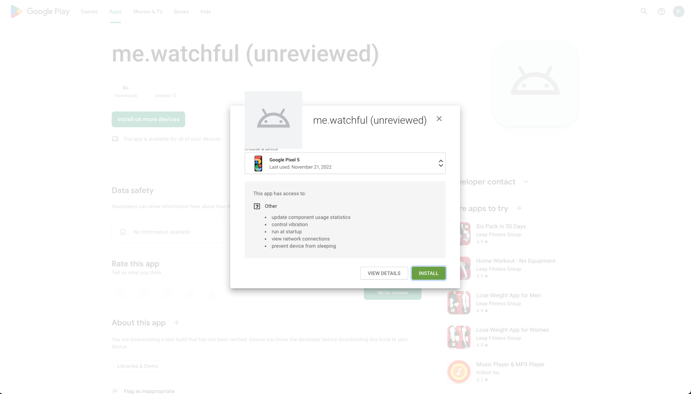

## Install Steps for your Phone

### Install app via `Google Play` link

You will receive a ==link== that points you to `play.google.com` that lets you install the Watchful apps on your phone and watch.

<!-- prettier-ignore-start -->
!!! warning
    You will need login with your Google account
<!-- prettier-ignore-end -->

<!-- prettier-ignore-start -->
!!! note
    Don't be alarmed by the `(unreviewed)` suffix. The reasons for this is, that the app has not yet been
    reviewed and approved by Google.
<!-- prettier-ignore-end -->

<figure markdown>
{ loading=lazy }
  <figcaption>Press the big green button labeled 'Install on more devices' </figcaption>
</figure>

<figure markdown>
{ loading=lazy }
  <figcaption>Select your phone in the dropdown menu.</figcaption>
</figure>

<figure markdown>
{ loading=lazy }
  <figcaption>et Voilá  🎉</figcaption>
</figure>
