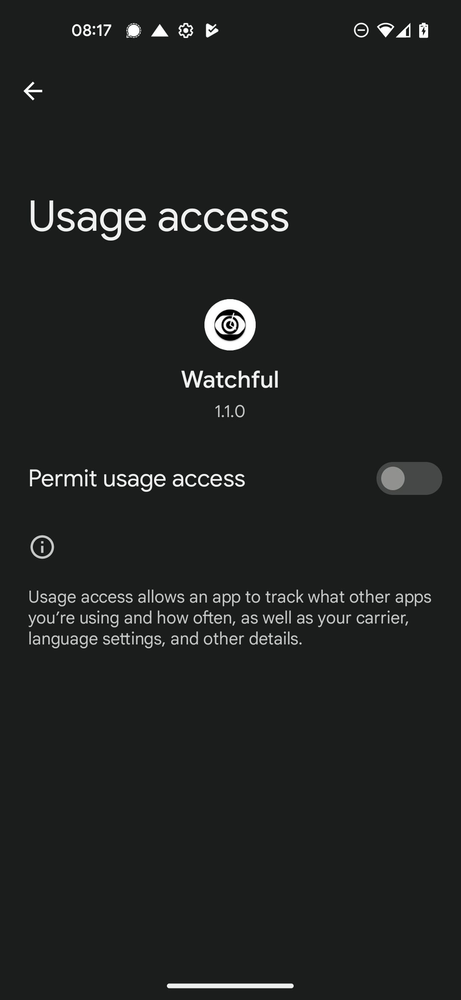

## Allow `Watchful` access to read usage statistics

<!-- prettier-ignore-start -->
!!! note
    Since Android 10 app permissions have become stricter to the point, that special permissions need to be actively
    provided to apps through you. see [Android Developer Documentation](https://developer.android.com/about/versions/10/privacy/changes) for more information.

    So you neeed to manually give Watchful  permission to gain access to usage data ... sorry
<!-- prettier-ignore-end -->

Go to `Settings` > `Apps` > `Special app access` > `usage access`

<figure markdown>
{ loading=lazy width="300"}
  <figcaption>  Permit usage access for Watchful ✅ </figcaption>
</figure>

<!-- prettier-ignore-start -->
!!! success
    Very nice! Not let's setup Watchful to access Google Fit!
<!-- prettier-ignore-end -->
