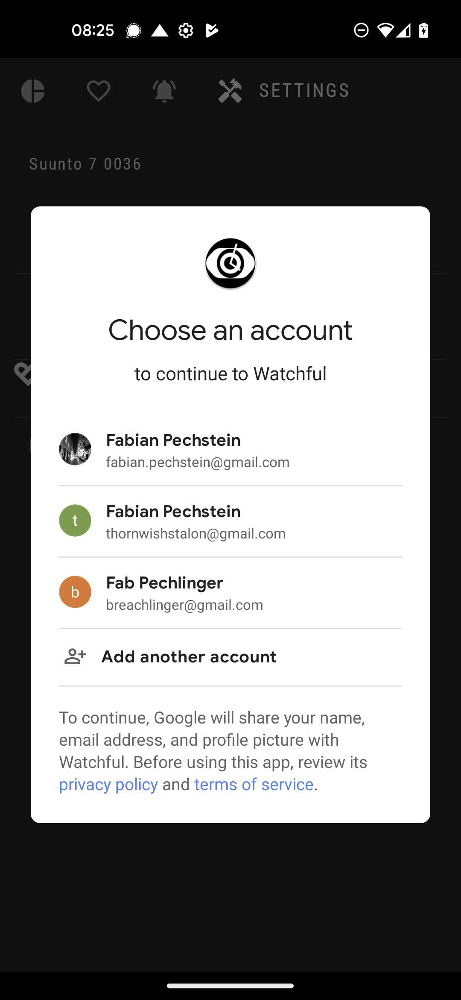
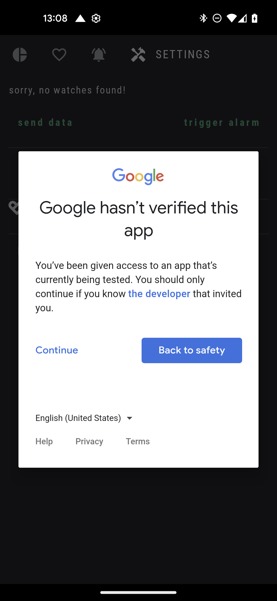
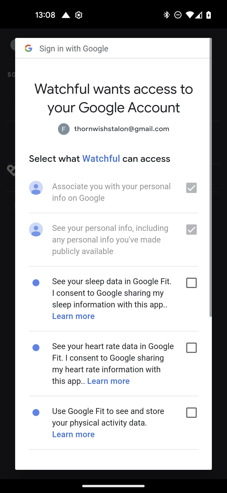
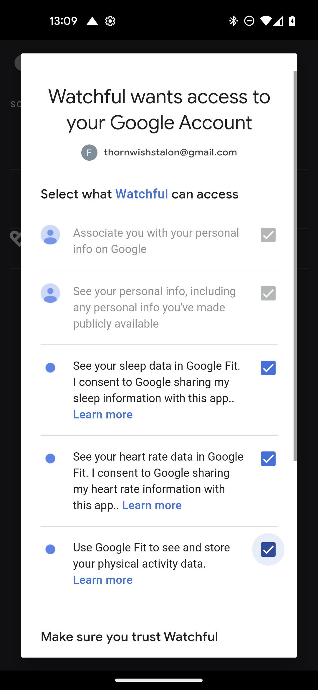
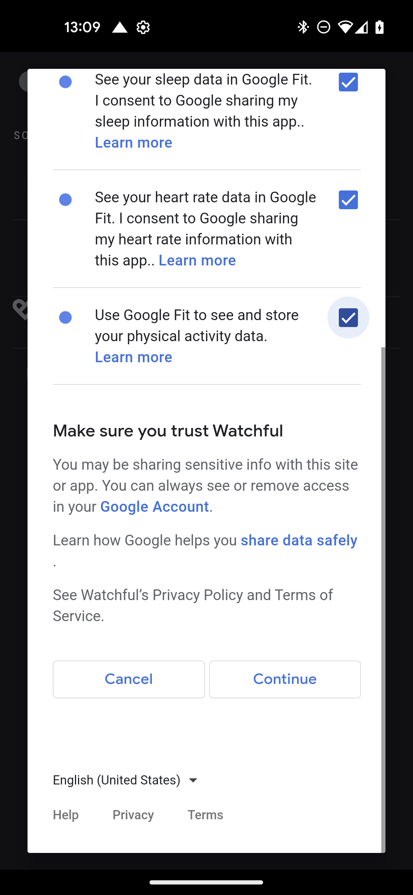

## Allow `Watchful` to access `Google Fit`

<!-- prettier-ignore-start -->
!!! note
    your will need to allow `Watchful` to read health data records from your google fit account.
<!-- prettier-ignore-end -->

This is done with the following steps:

### Open Watchful app

### Goto Settings

#### Press login button

<figure markdown>
{ loading=lazy width="300"}
  <figcaption> press login </figcaption>
</figure>

#### Select your Google Fit account

<figure markdown>
{ loading=lazy width="300"}
  <figcaption> select your Google account </figcaption>
</figure>

#### Follow the oAuth flow

You will need to read through the consent form and accept it.

<figure markdown>
{ loading=lazy width="300"}
</figure>

<!-- prettier-ignore-start -->
!!! note
    Until `Watchful` is verified you will see a warning like this
<!-- prettier-ignore-end -->

<figure markdown>
{ loading=lazy width="300"} 
</figure>

<!-- prettier-ignore-start -->
!!! note
    You have the choice of what you share with Watchful
<!-- prettier-ignore-end -->

<figure markdown>
{ loading=lazy width="300"}
</figure>

<figure markdown>
{ loading=lazy width="300"}
  <figcaption> Please trust Watchul </figcaption>
</figure>

<!-- prettier-ignore-start -->
!!! success
    great! now you the 'health' section should show more than a warning label :: 
<!-- prettier-ignore-end -->

## **[Optional]** Enable phone notifications

<!-- prettier-ignore-start -->
!!! note
    when `phone notifications`are enabled your usage-alarms will create a notification on your phone besides making 
    some noise on your watch!
<!-- prettier-ignore-end -->

<figure markdown>
{ loading=lazy width="300"}
  <figcaption> Phone notifications settings </figcaption>
</figure>

<!-- prettier-ignore-start -->
!!! note
    In case phone notifications are enabled, you will also get a notification on your phone when alarms get triggered by you!

    See the example below: 

<!-- prettier-ignore-end -->

<figure markdown>
{ loading=lazy width="300"}
</figure>

<!-- prettier-ignore-start -->
!!! success
    Yay! Now your phone is ready. Let's start on your watch!
<!-- prettier-ignore-end -->
