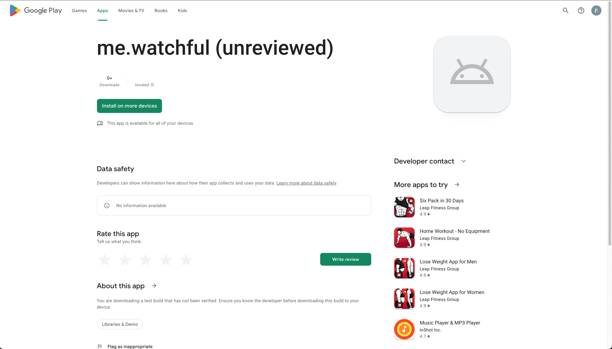
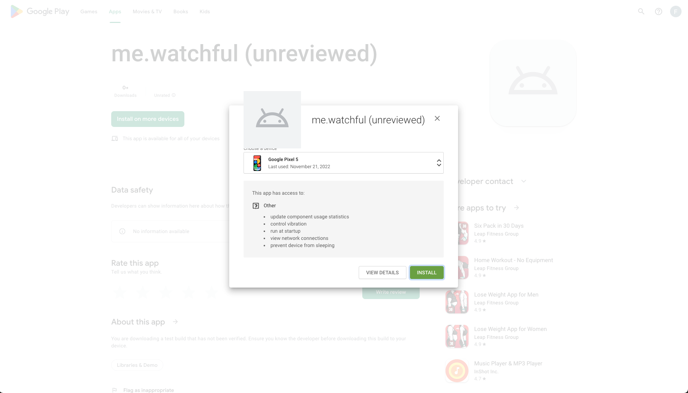

## Install Steps for your Phone

### Step 1: Install via `Google Play` link

You will receive a ==link== that points you to `play.google.com` that lets you install the Watchful apps on your phone and watch.

<!-- prettier-ignore-start -->
!!! warning
    You will need login with your Google account
<!-- prettier-ignore-end -->

<!-- prettier-ignore-start -->
!!! note
    Don't be alarmed by the `(unreviewed)` suffix. The reasons for this is, that the app has not yet been
    reviewed and approved by Google.
<!-- prettier-ignore-end -->

<figure markdown>
{ loading=lazy }
  <figcaption>Press the big green button labeled 'Install on more devices' </figcaption>
</figure>

<figure markdown>
{ loading=lazy }
  <figcaption>Select your phone in the dropdown menu.</figcaption>
</figure>

<figure markdown>
{ loading=lazy }
  <figcaption>et Voilá  🎉</figcaption>
</figure>

### Step 2: Allow `Watchful` access to read usage statistics

<!-- prettier-ignore-start -->
!!! note
    Since Android 10 app permissions have become stricter to the point, that special permissions need to be actively
    provided to apps through you. see [Android Developer Documentation](https://developer.android.com/about/versions/10/privacy/changes) for more information.
<!-- prettier-ignore-end -->

### Step 3: Allow `Watchful` to access `Google Fit`

!!! note
your will need to allow `Watchful` to read health data records from your google fit account.

This is done with the following steps:

- open Watchful
- goto settings
- press login button
- select your google fit account
- TODO: follow the oauth flow
- restart the app ()

## **[Optional]** enable phone notifications
