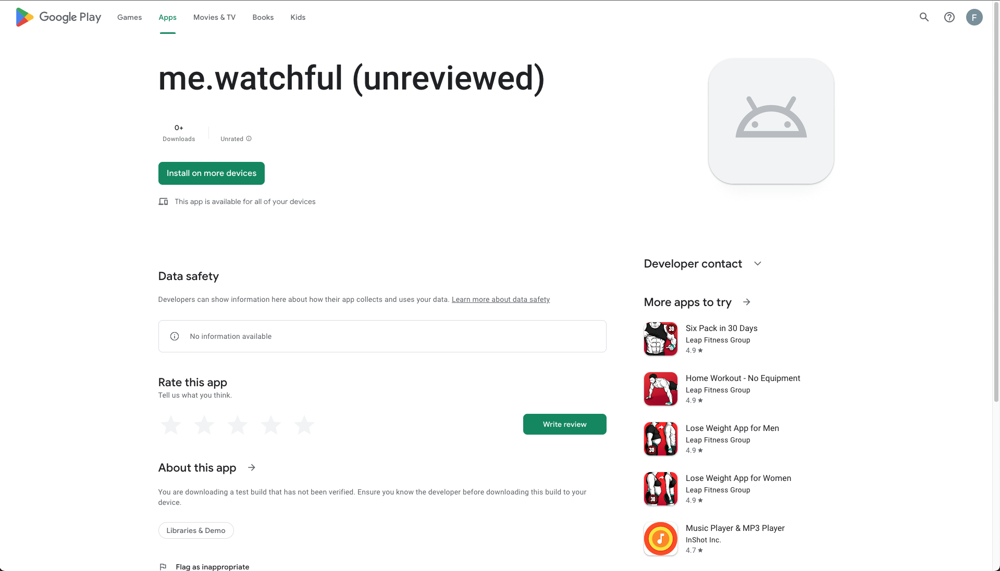
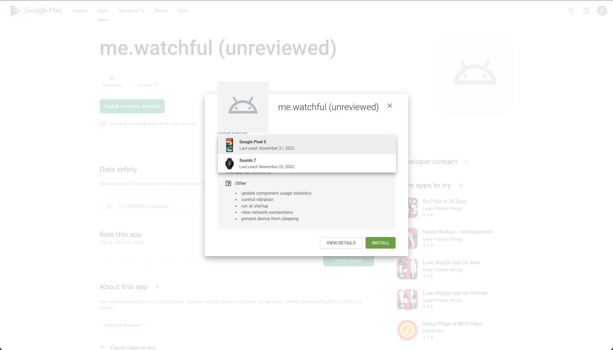
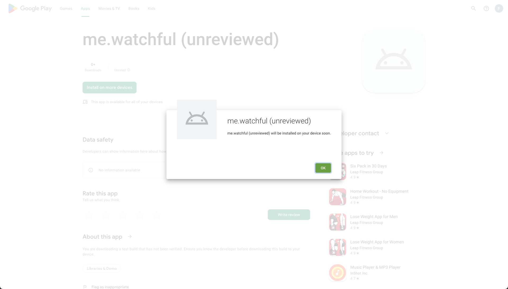

## Install on Watch

Surprisingly, installing `Watchful` on a WearOS watch is not so much different than installing it on a phone.

### Use Google Play Store link

You will receive a ==link== that points you to `play.google.com` that lets you install the Watchful apps on your phone and watch.

<!-- prettier-ignore-start -->
!!! warning
    You will need login with your Google account
<!-- prettier-ignore-end -->

<!-- prettier-ignore-start -->
!!! note
    Don't be alarmed by the `(unreviewed)` suffix. The reasons for this is, that the app has not yet been
    reviewed and approved by Google.
<!-- prettier-ignore-end -->

<figure markdown>
{ loading=lazy }
  <figcaption>Press the big green button labeled 'Install on more devices' </figcaption>
</figure>

<figure markdown>
{ loading=lazy }
  <figcaption>Select your watch in the dropdown menu.</figcaption>
</figure>

<figure markdown>
{ loading=lazy }
  <figcaption>et Voilá  🎉</figcaption>
</figure>

<!-- prettier-ignore-start -->
!!! success
    well done. That's it for the installation. **BUT** to make the most of Watchful please setup 
    GoogleFit and the Suunto app! :wink:
<!-- prettier-ignore-start -->

<!-- prettier-ignore-start -->
!!! tip
    The `Watchful`-App on your phone will query fitness data from {++GoogleFit++}. This data is collected first through the
    watch.  
<!-- prettier-ignore-end -->
