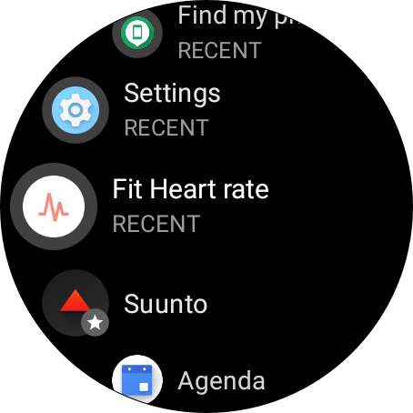
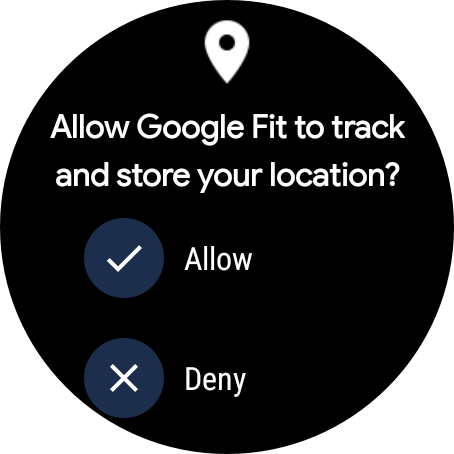
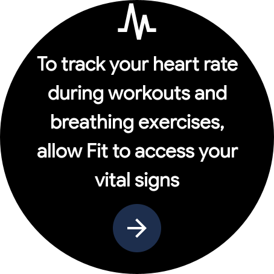
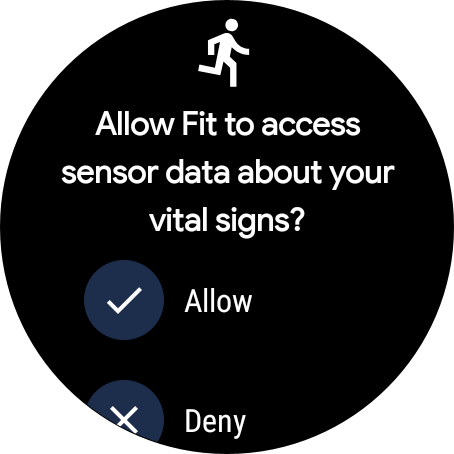
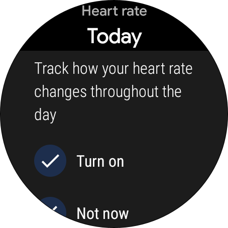
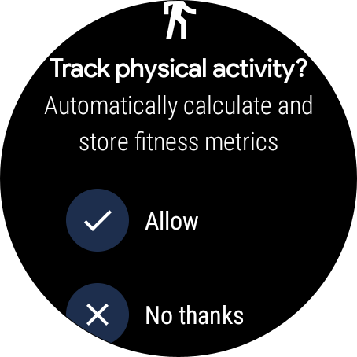

## Sorry first, but be warned!

<!-- prettier-ignore-start -->
!!! warning
    The Fit Android API has been {==deprecated==} as of May 11, 2022 and {==will be turned down at the end of 2024==}.

    **BUT** until then let's see if we can make the most of the available health data! **And then** lets move to 
    {==Health Connect==} (see [documentation](https://developer.android.com/guide/health-and-fitness/health-connect)) 
<!-- prettier-ignore-end -->

## Enable GoogleFit on the watch

The Suunto 7 comes pre-installed with GoogleFit. But you will need to finish the authorization flow, like so:

<figure markdown>
{ loading=lazy }
  <figcaption> Start any of the {==Fit==} applications </figcaption>
</figure>

<figure markdown>
{ loading=lazy }
  <figcaption> This will start the authentication and authorisation flow on your watch </figcaption>
</figure>

<figure markdown>
{ loading=lazy }
  <figcaption> Select your Google account that you intend to use </figcaption>
</figure>

<!-- prettier-ignore-start -->
!!! note
    You will need to define what kind of data GoogleFit will keep of you: 
<!-- prettier-ignore-end -->

<figure markdown>
{ loading=lazy }
  <figcaption> Watchful does not require your locations, that's up to you! </figcaption>
</figure>

<figure markdown>
{ loading=lazy }
  <figcaption> This gets more interesting now:  </figcaption>
</figure>

<figure markdown>
{ loading=lazy }
  <figcaption> Yes, please! ✅ </figcaption>
</figure>

<figure markdown>
{ loading=lazy }
  <figcaption> Watchful will requires this kind of data as well! ✅ </figcaption>
</figure>

<figure markdown>
{ loading=lazy }
  <figcaption> That's optional from our side 🤷‍ BUT could be interesting for you. </figcaption>
</figure>

<!-- prettier-ignore-start -->
!!! success
    Yay! Now you will just need to setup sleep tracking
<!-- prettier-ignore-end -->
