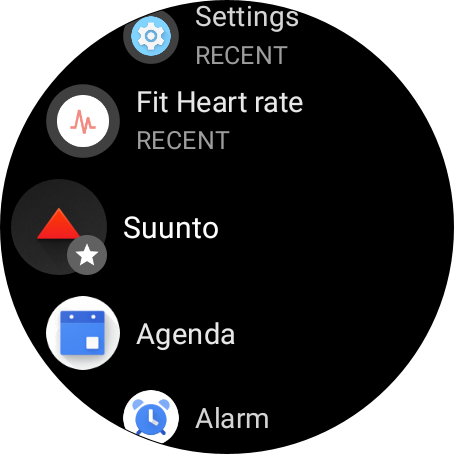
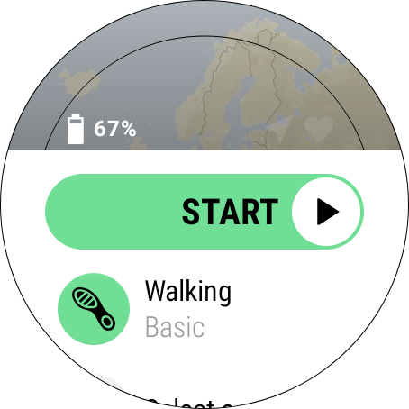
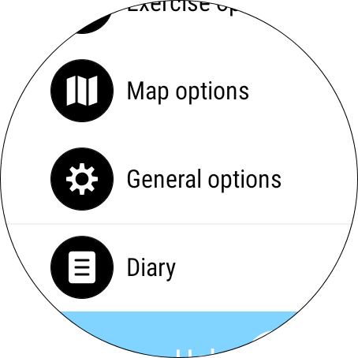
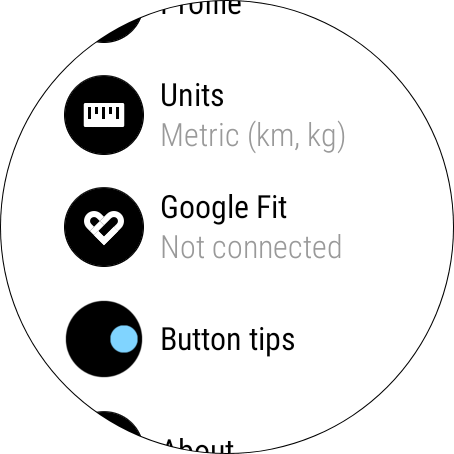
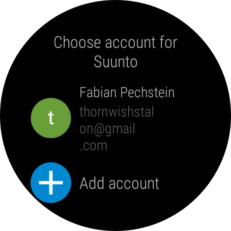
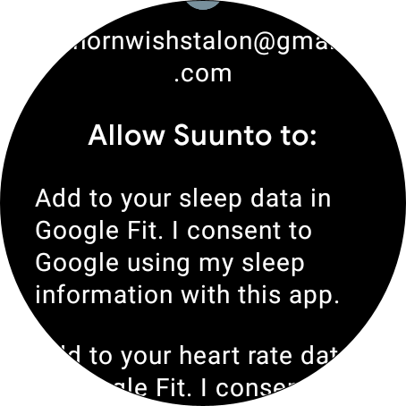

<!-- prettier-ignore-start -->
!!! info 
    Google Fit doesn't track sleep, **BUT** Suunto does :wink:
<!-- prettier-ignore-end -->

<!-- prettier-ignore-start -->
!!! warning
    make sure that you have Sunnto's latest firmware installed! 

    See [Keep your Suunto 7 up to date](https://www.suunto.com/en-gb/Support/Product-support/suunto_7/suunto_7/get-started/keep-your-suunto-7-up-to-date/)

<!-- prettier-ignore-end -->

<figure markdown>
{ loading=lazy }
  <figcaption> Start the pre-installed Suunto application </figcaption>
</figure>

<figure markdown>
{ loading=lazy }
  <figcaption> Nice! Scroll a little down to ...  </figcaption>
</figure>

<figure markdown>
{ loading=lazy }
  <figcaption> General options ✅ </figcaption>
</figure>

<figure markdown>
{ loading=lazy }
  <figcaption> Let's connect wit Google Fit ✅ </figcaption>
</figure>

<figure markdown>
{ loading=lazy }
  <figcaption> Yes, Sign in with Google ...  ✅ </figcaption>
</figure>

<figure markdown>
{ loading=lazy }
  <figcaption> ... and choose your Google account again ✅ </figcaption>
</figure>

<figure markdown>
{ loading=lazy }
  <figcaption> This will authorize Suunto to push sleep data to your Google Fit account. Please allow to have sleep data available in Watchful ✅ </figcaption>
</figure>

<!-- prettier-ignore-start -->
!!! success
    :tada: Awesome! Next up: the face!
<!-- prettier-ignore-end -->
