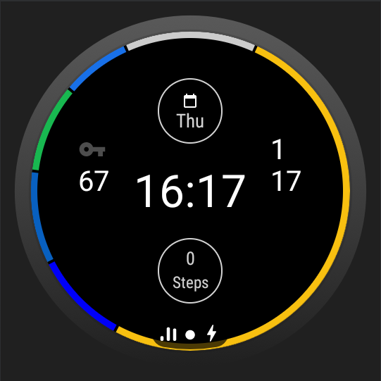

<!-- prettier-ignore-start -->
!!! info 
    WearOS let's you customize your watch's home screen (see [here](https://support.google.com/wearos/answer/6140435?hl=en) for more information ) 
<!-- prettier-ignore-end -->

With Watchful installed on your watch there is a watchface available called `Usage Digial`!

<figure markdown>
{ loading=lazy }
  <figcaption> Watchful's Watchface </figcaption>
</figure>

## available features

- how many times did you unlock your phone since midnight?
- home much time spent you on apps since midnight?
- colors respond to apps (shows your top 5 apps, where you've spent your time today)
- 2 complication fields available for customizations

<!-- prettier-ignore-start -->
!!! success
    :tada: Awesome, **You** are now set up!
<!-- prettier-ignore-end -->
