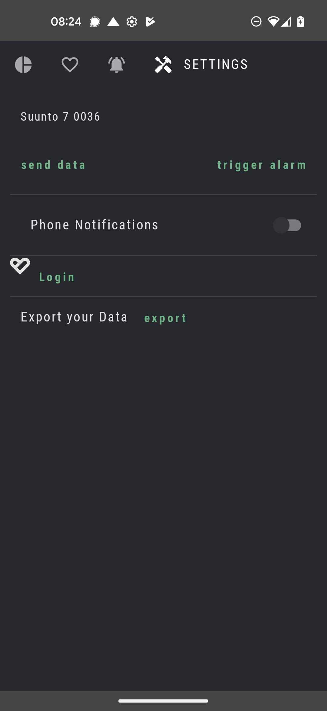
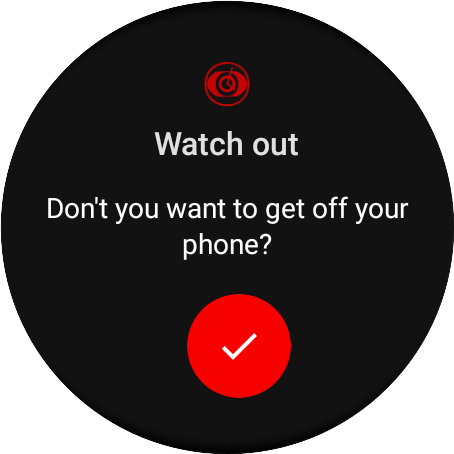
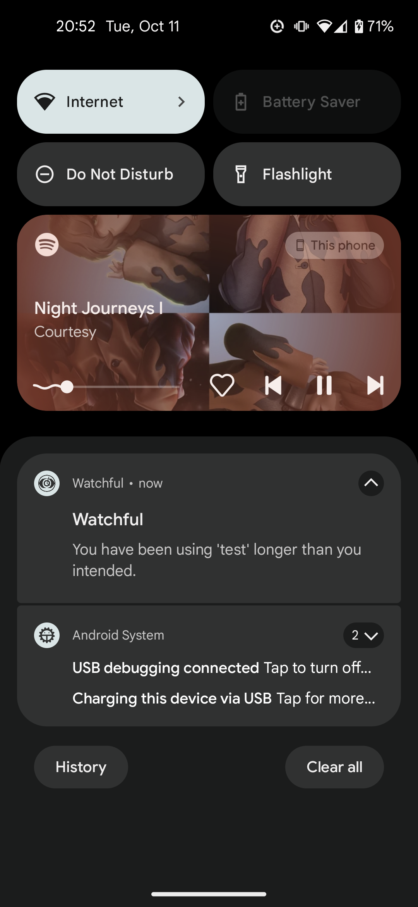

<!-- prettier-ignore-start -->
!!! note

    You can easily see if your phone finds your watch!

<!-- prettier-ignore-end -->

## Go to Settings in your Watchful Phone app

<figure markdown>
{ loading=lazy width="300"}
  <figcaption> you should see a watch-name at the top </figcaption>
</figure>

## Test alarm signal

press `trigger alarm` and your watch should start vibrating and displaying something like this:

<figure markdown>
{ loading=lazy width="300"}
  <figcaption> you better watch out ☝️ </figcaption>
</figure>

<!-- prettier-ignore-start -->
!!! note
    in case phone notifications are enabled, you will also get a notification on your phone! 
    
    See the example below: 

<!-- prettier-ignore-end -->

<figure markdown>
{ loading=lazy width="300"}
</figure>

<!-- prettier-ignore-start -->
!!! success 

    you are good to go! :tada: 

<!-- prettier-ignore-end -->
