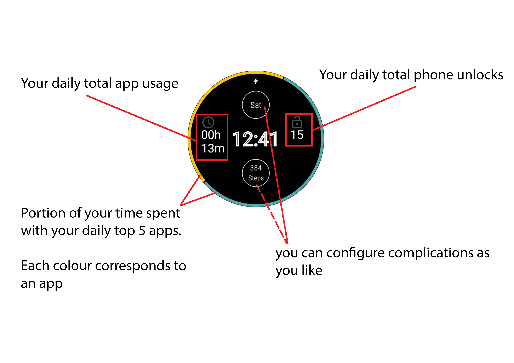

# Watch Face

<figure markdown>
{ loading=lazy }
  <figcaption>How to read the watchface</figcaption>
</figure>

# Phone vs Watch UI

Imagine your Watchful phone app displays the following state:

<figure markdown>
{ loading=lazy width="300" }
  <figcaption>An example state on your phone.</figcaption>
</figure>

then your watch-face will show you the same information

<figure markdown>
{ loading=lazy width="300"}
  <figcaption>the example state on your watch.</figcaption>
</figure>
